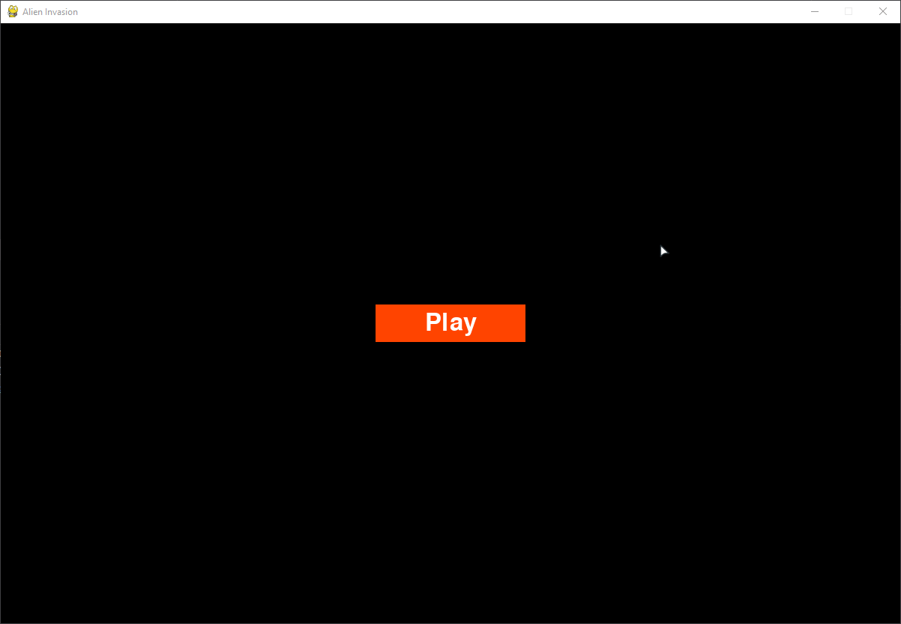

# Python-Invasion

A simple clone of Alien Invasion on atari, created using pyGame library.

# How to run?

1) Install `python3` on your PC with `pip manager`
2) Clone repo to your local machine using`git clone https://github.com/T-Damer/Python-Invasion`
3) Use any file editor you want, I recommend `PyCharm` or `VsCode`, also I made virtual environment for this project
4) Packages already installed in `venv library root`, I used `pip install pygame`.
5) Run `run_game.py` using `py run_game.py` or `python3 run_game.py` (remember to cd.. to this folder)

# Cheats and configuring

If you want to change some setting, please look in `src/settings.py`
